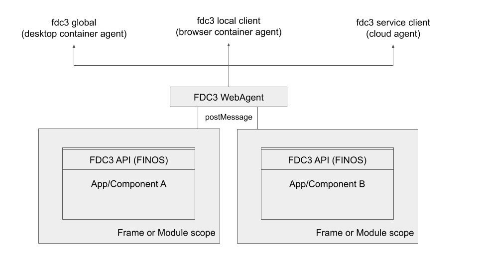

# fdc3-web-portal
Reference implementation of an FDC3 provider pattern and the [Connectifi](https://connectifi.co) interop service

## Provider Pattern
This is a pattern for enabling apps to use a single library for FDC3 regardless of what the actual FDC3 implementation is.  It also allows micro apps in a single page to interact with each other "locally" as well as with the "external" real FDC3 implementation.

Applications/components import and create their FDC3 apis via the *createWebAgentAPI* call .  This returns an FDC3 API which uses `postMessage` to communicate with the *WebAgent* which ultimately binds to the real FDC3 implementation.  In this example, the *WebAgent* is binding to the *Connectifi* agent for interop outside of the web page.



**Notes** 

- The API/WebAgent combo should work for apps implemented in iFrames or components existing in the same DOM using module scope.  The included test harness page uses iframes.
- the `createWebAgentAPI` function allows apps and/or components to acquire an FDC3 api
- the `WebAgent` allows the top level page to bind to the real FDC3 implementation and communicate with all the WebAgentAPIs in the page

## WebAgent Pattern
In this example, the FDC3Provider is the *WebAgent* which implements a local bus for FDC3 interop within the page while connecting to a wider FDC3 implementation enabling FDC3 interop outside of the page.  The *WebAgent* setup looks like this:

```js
 const localAgent: WebAgent = new WebAgent();
 // bind the web agent to the main FDC3 implementation
 localAgent.bind(fdc3);

```

**Notes**
- the WebAgent can support any number of FDC3 providers.
- the WebAgent allows apps to broadcast to each other via FDC3 within scope of the web page
- the local apps have channel membership independent of the page they are running on


## Project setup

- clone
- `npm i`
- `npm run dev`
- open http://localhost:5173/


## Development

The project currently has the following parts:

- `index.html` & `app1.html` - test harness UIs
- `src/agent.ts` - this is the harness app code, instantiates the *WebAgent* and connects to the *Connectifi* service
- `src/common` - contains the types and topics used in the postMessage *wire protocol* between the api and web agent
- `src/webAgent` - the WebAgent implementation (top level page)
- `src/webAgentAPI` - the FDC3 API implementation (sub apps/components)

## Next Steps

(in no certain order)

- integrate intents with the WebAgent (currently just deferring to the FDC3Provider)
- add 2.0 support
- add module / non-iframe example
- test against desktop agents
