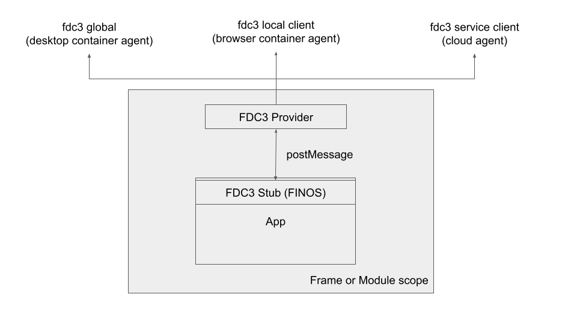

# fdc3-web-portal
Reference implementation of a web portal using FDC3 Stub/Provider pattern and the [Connectifi](https://connectifi.co) interop service

## Stub/Provider Pattern
This is a pattern for enabling apps to use a single library for FDC3 regardless of who the FDC3 provider ultimately is.  

The provider code - *FDC3Stub* - is loaded into each app.  The stub exposes an FDC3 API and use `postMessage` to discover and then binds to a *FDC3Provider*.  In this case, the provider is the `localAgent` - ultimately, the provider owns the FDC3 implementation.



** Notes: 

- Stub/Provider pattern should work for apps implemented in either iFrames or in the same DOM (using module scope).  This implementation is just currently with iFrames
- the FDC3stub currently exposes the proposed `installer()` function for apps to acquire an FDC3 api

## LocalAgent Pattern
In this example, the FDC3Provider is a *LocalAgent* which implements a local bus for FDC3 within the page and connects to a wider FDC3 implementation provided to it - allowing it to use FDC3 outside of the page.  The *LocalAgent* setup looks like this:

```js
 const localAgent: LocalAgent = new LocalAgent();
 //attain the fdc3 reference and set it on the localAgent
 localAgent.setFDC3(fdc3);

```

** Notes:
- the localAgent can support any number of FDC3 providers.  In this example it is using Connectifi.
- the localAgent allows apps to broadcast to each other without leaving the page
- the local apps have independent color channel membership from the page they are running on 


## Project setup

- clone
- `npm i`
- `npm run dev`
- open http://localhost:5173/


## Development

The project currently has the following parts:

- `index.html` & `app1.html` - test harness UIs
- `src/main.ts` - this is the harness app code, instantiates the *LocalAgent* and connects to the *Connectifi* service
- `src/common` - contains the types and topics used in the postMessage *wire protocol* between the FDC3 Stub & Provider
- `src/localAgent` - the LocalAgent implementation
- `src/fdc3Stub` - the FDC3Stub implementation

## Next Steps

(in no certain order)

- integrate intents with the localAgent (currently just deferring to the FDC3Provider)
- add 2.0 support
- add module / non-iframe example
- test against desktop agents